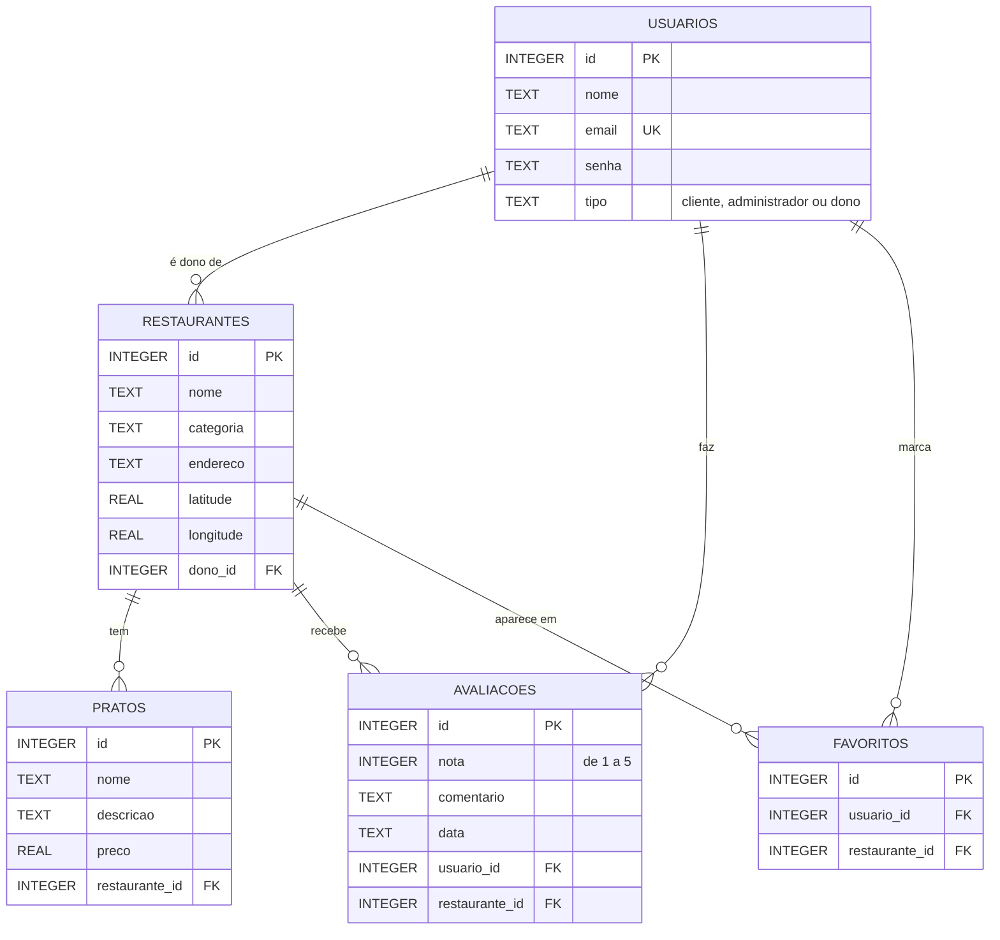

# 🍽️ Coma Bem

Aplicativo Flutter para **descobrir restaurantes, ver os pratos, avaliar e salvar favoritos**. Os dados ficam guardados localmente em um banco **SQLite** (via `sqflite`), e o app roda no Android, iOS, Web e desktop.

---

## 📋 Sumário

- [Funcionalidades](#-funcionalidades)
- [Tecnologias](#-tecnologias)
- [Estrutura do projeto](#-estrutura-do-projeto)
- [Banco de dados](#-banco-de-dados)
- [Conceitos de POO aplicados](#-conceitos-de-poo-aplicados)
- [Como executar](#-como-executar)
- [Testes](#-testes)
- [Autor](#-autor)

---

## ✨ Funcionalidades

- **Splash screen** com imagem de fundo
- **Login** e **cadastro de usuários** (com validação de senha)
- **Perfis de usuário** diferentes: cliente, administrador e dono de restaurante
- **Catálogo** de restaurantes
- **Tela de detalhes** do restaurante, com pratos e avaliações
- **Avaliação** com estrelas e comentário
- **Favoritos**: salvar e consultar restaurantes preferidos
- **Perfil** do usuário
- **Navegação por abas** (catálogo, favoritos e perfil)

---

## 🛠️ Tecnologias

| Tecnologia | Uso no projeto |
|---|---|
| [Flutter](https://flutter.dev) / Dart | Interface e lógica do aplicativo |
| [sqflite](https://pub.dev/packages/sqflite) | Banco de dados SQLite em Android e iOS |
| [sqflite_common_ffi_web](https://pub.dev/packages/sqflite_common_ffi_web) | Banco de dados SQLite no navegador (Web) |
| [geolocator](https://pub.dev/packages/geolocator) | Localização do dispositivo |
| [path](https://pub.dev/packages/path) | Manipulação do caminho do arquivo do banco |

---

## 📁 Estrutura do projeto

```
coma_bem/
├── assets/
│   └── images/
│       └── splash_background.jpg     # Imagem de fundo da splash
├── lib/
│   ├── components/                   # Widgets reutilizáveis
│   │   ├── botao_customizado.dart
│   │   ├── campo_formulario_customizado.dart
│   │   └── estrelas_avaliacao.dart
│   ├── database/
│   │   └── database_helper.dart      # Criação e acesso ao banco
│   ├── models/                       # Classes de domínio
│   │   ├── usuario.dart
│   │   ├── cliente.dart
│   │   ├── administrador.dart
│   │   ├── dono_restaurante.dart
│   │   ├── restaurante.dart
│   │   ├── prato.dart
│   │   └── avaliacao.dart
│   ├── screens/                      # Telas do app
│   │   ├── splash_screen.dart
│   │   ├── login_screen.dart
│   │   ├── cadastro_screen.dart
│   │   ├── cadastro_usuario_screen.dart
│   │   ├── home_screen.dart
│   │   ├── main_navigation_screen.dart
│   │   ├── catalogo_tab.dart
│   │   ├── detalhe_restaurante_screen.dart
│   │   ├── favoritos_tab.dart
│   │   └── perfil_tab.dart
│   ├── services/
│   │   └── favoritos_service.dart    # Regras de favoritos
│   ├── main.dart                     # Ponto de entrada
│   ├── simulador_terminal.dart       # Simulação via terminal
│   ├── teste_fluxo.dart              # Teste do fluxo principal
│   └── teste_heranca.dart            # Teste de herança/polimorfismo
├── integration_test/                 # Testes de integração
├── test/                             # Testes de widget
├── web/                              # Arquivos da versão Web (inclui sqlite3.wasm)
├── codigo.sql                        # Script SQL do banco
├── BUG_001_LOGIN.md                  # Registro de bug do login
└── pubspec.yaml                      # Dependências e assets
```

---

## 🗄️ Banco de dados

<!-- REVISAR: este diagrama e as tabelas abaixo devem ser conferidos com codigo.sql e lib/database/database_helper.dart. Se algum nome de tabela ou coluna for diferente, ajuste o texto. -->

O app usa **SQLite**, um banco relacional que fica dentro do próprio aplicativo, sem precisar de servidor. Os dados são organizados em **tabelas**, e as tabelas se ligam por **chaves estrangeiras**.



### Como entender o diagrama

- **Cada caixa é uma tabela.** As linhas dentro dela são as colunas (os campos guardados).
- **PK (chave primária)** é o `id` que identifica cada registro de forma única.
- **FK (chave estrangeira)** é uma coluna que guarda o `id` de outra tabela e cria a ligação entre elas.
- **UK (única)** indica que o valor não pode se repetir, como o e-mail do usuário.
- **As linhas ligam as tabelas.** O lado com o símbolo de "garra" representa **vários**: um registro da tabela do outro lado pode se relacionar com muitos dele.

### Tabelas

| Tabela | O que guarda |
|---|---|
| `usuarios` | Todas as pessoas que usam o app. A coluna `tipo` diferencia cliente, administrador e dono de restaurante |
| `restaurantes` | Restaurantes cadastrados, com categoria, endereço e coordenadas. Cada um pertence a um dono (`dono_id`) |
| `pratos` | Pratos do cardápio. Cada prato pertence a um restaurante (`restaurante_id`) |
| `avaliacoes` | Nota (1 a 5) e comentário que um usuário deu a um restaurante |
| `favoritos` | Liga um usuário a um restaurante que ele marcou como favorito |

### Relacionamentos

- Um **usuário** (dono) pode ter vários **restaurantes**
- Um **restaurante** tem vários **pratos**
- Um **usuário** pode fazer várias **avaliações**, e um **restaurante** pode receber várias
- Um **usuário** pode ter vários **favoritos**, e um **restaurante** pode ser favoritado por vários usuários

> `favoritos` é uma **tabela de associação**: ela existe para representar a relação muitos-para-muitos entre usuários e restaurantes.

---

## 🧩 Conceitos de POO aplicados

- **Herança:** `Cliente`, `Administrador` e `DonoRestaurante` estendem a classe base `Usuario`
- **Polimorfismo:** cada tipo de usuário pode se comportar de forma própria a partir da mesma interface (veja `lib/teste_heranca.dart`)
- **Encapsulamento:** a classe `Usuario` valida a senha no *setter*, impedindo que uma senha inválida seja atribuída
- **Separação de responsabilidades:** modelos em `models/`, acesso a dados em `database/`, regras em `services/` e interface em `screens/` e `components/`

---

## 🚀 Como executar

### Pré-requisitos

- [Flutter SDK](https://docs.flutter.dev/get-started/install) instalado (`flutter doctor` sem erros)
- Git
- Um navegador (Chrome ou Edge) para rodar na Web, ou um emulador/dispositivo Android/iOS

### Passo a passo

```bash
# 1. Clone o repositório
git clone https://github.com/RuanPblo/coma_bem.git
cd coma_bem

# 2. Baixe as dependências
flutter pub get

# 3. Execute o app
flutter run -d edge      # navegador Edge
# flutter run -d chrome  # navegador Chrome
# flutter run            # dispositivo ou emulador conectado
```

### Observações sobre a versão Web

No navegador, o SQLite funciona com os arquivos `web/sqlite3.wasm` e `web/sqflite_sw.js`, que já estão no repositório. Se eles forem apagados ou ficarem desatualizados, gere-os novamente com:

```bash
dart run sqflite_common_ffi_web:setup
```

Ao rodar na Web, o navegador também pedirá permissão para acessar a localização, por causa do `geolocator`.

### Imagem da splash

A imagem de fundo fica em `assets/images/` e precisa estar declarada no `pubspec.yaml`:

```yaml
flutter:
  uses-material-design: true
  assets:
    - assets/images/
```

Depois de adicionar novos assets, **reinicie o app por completo**, pois o hot reload não os carrega.

---

## 🧪 Testes

```bash
flutter test                 # testes de widget
flutter test integration_test   # testes de integração (exigem dispositivo/emulador)
```

O arquivo `lib/teste_fluxo.dart` e o `lib/simulador_terminal.dart` permitem exercitar o fluxo principal sem abrir a interface.

---

## 👤 Autor

Desenvolvido por **[RuanPblo](https://github.com/RuanPblo)**.